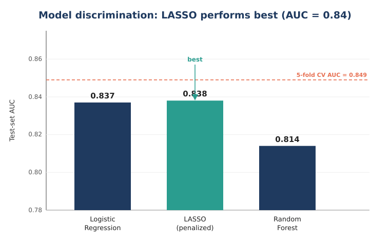
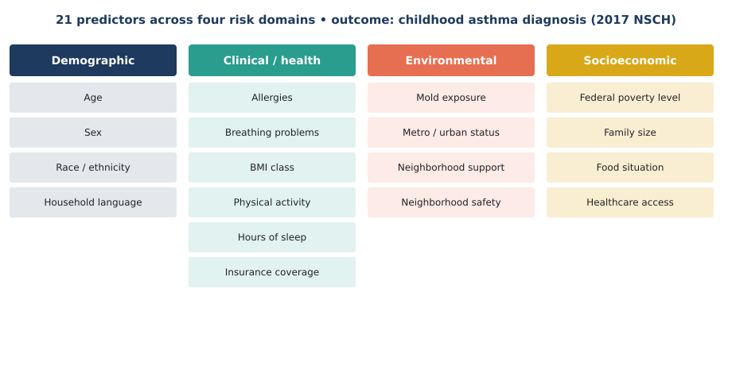
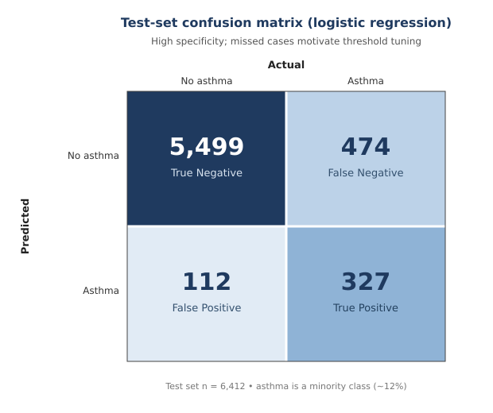

# Childhood Asthma Risk Modeling

### Statistical and machine-learning prediction of childhood asthma using nationally representative survey data


A reproducible R workflow that builds and compares interpretable and machine-learning models to predict childhood asthma diagnosis from demographic, clinical, environmental, and socioeconomic risk factors in the **2017 National Survey of Children's Health (NSCH)** — a nationally representative U.S. dataset of ~21,600 children.

---

## Key Result

Across three modeling approaches, a **LASSO-penalized logistic regression achieved the best discrimination (AUC = 0.84)**, narrowly ahead of standard logistic regression and outperforming a random forest. Five-fold cross-validation (CV AUC = 0.849) confirmed the result is stable rather than an artifact of a single split.



---

## Background

Asthma is the most common chronic disease of childhood, and risk is shaped by a mix of biological, environmental, and social factors. Using the nationally representative NSCH survey, this project asks a practical question: **how well can routinely collected survey factors predict whether a child has been diagnosed with asthma**, and which modeling approach balances accuracy with interpretability for a public-health setting?

## Data and Predictors

The outcome is a binary asthma diagnosis (NSCH item `K2Q40A`, recoded to yes/no). Twenty-one predictors were selected across four risk domains:



Asthma is a **minority outcome** in the sample (roughly 1 in 8 children), so the analysis emphasizes threshold-independent metrics (AUC) and model calibration rather than raw accuracy, which is inflated by class imbalance.

## Methods

The workflow (`analysis/`) is written in R Markdown and is fully reproducible (`set.seed(123)`):

1. **Data preparation** — variable selection from the raw NSCH file, recoding of the asthma outcome, handling of survey missing-value codes, and construction of a clean modeling dataset.
2. **Modeling** — three approaches fit on a 70/30 train–test split:
   - **Logistic regression** — interpretable baseline.
   - **LASSO-penalized logistic regression** — automatic feature selection / regularization.
   - **Random forest** — non-linear, interaction-capturing benchmark.
3. **Validation** — 5-fold cross-validation of the logistic model, plus held-out test-set evaluation.
4. **Calibration** — recalibration models to check that predicted probabilities track observed risk.

## Results

| Model | AUC | Accuracy | Precision | Recall |
|-------|-----|----------|-----------|--------|
| Logistic regression | 0.837 | 0.911 | 0.921 | 0.983 |
| **LASSO (penalized)** | **0.838** | 0.910 | 0.919 | 0.984 |
| Random forest | 0.814 | 0.909 | 0.921 | 0.980 |

*5-fold cross-validated AUC (logistic): **0.849**.*

At the default 0.5 threshold the models favor **specificity** — they correctly rule out asthma in the large non-asthma majority, but miss a meaningful share of true cases. The confusion matrix below makes this trade-off explicit and motivates threshold tuning as a clear next step.



## Key Takeaways

- **Simple, interpretable models win here.** LASSO and logistic regression matched or beat the random forest, suggesting the predictive signal in these survey factors is largely additive — an interpretability advantage in a public-health context.
- **Class imbalance matters.** High headline accuracy is driven by the non-asthma majority; AUC (~0.84) and calibration give the honest picture of performance.
- **Actionable next step.** Probability-threshold tuning (or cost-sensitive learning) would trade some specificity for the sensitivity needed to flag at-risk children.

## Repository Structure

```
childhood-asthma-risk-modeling/
│
├── analysis/
│   ├── final code_Gautami.html   # Rendered R Markdown: full code + outputs
│   └── README.md
├── data/
│   ├── data dictionary           # NSCH variable definitions
│   └── README.md
├── report/
│   ├── final report_Gautami.pdf  # Full academic write-up
│   └── README.md
├── asthma_fig1_model_auc.svg     # README figures
├── asthma_fig2_confusion.svg
├── asthma_fig3_predictors.svg
├── .gitignore
├── LICENSE
└── README.md
```

## How to Reproduce

1. Download the **2017 NSCH Topical dataset** (public, see Data Source below).
2. Update the input file path at the top of the R Markdown in `analysis/`.
3. Knit the R Markdown in R (≥ 4.3) with: `dplyr`, `ggplot2`, `janitor`, `skimr`, `readr`, `glmnet`, `randomForest`, `caret`, `pROC`.

## Skills Demonstrated

Survey-data wrangling and recoding · binary outcome modeling · regularized regression (LASSO) · ensemble methods (random forest) · cross-validation · model calibration · handling class imbalance · reproducible reporting in R Markdown · communicating results for a public-health audience.

## Data Source

2017 National Survey of Children's Health (NSCH), Data Resource Center for Child & Adolescent Health (CAHMI). Publicly available: https://www.childhealthdata.org/

## Author

**Gautami Deshpande** — bioinformatics & health data analysis.

*Released under the MIT License.*
